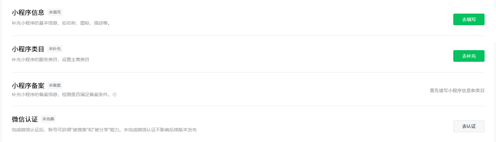
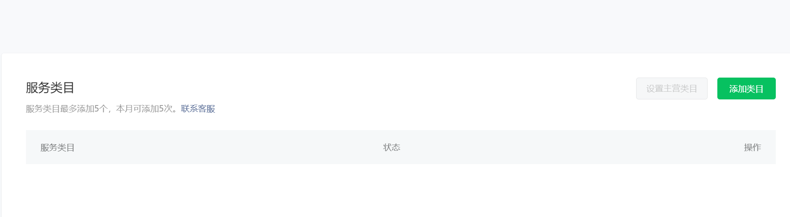
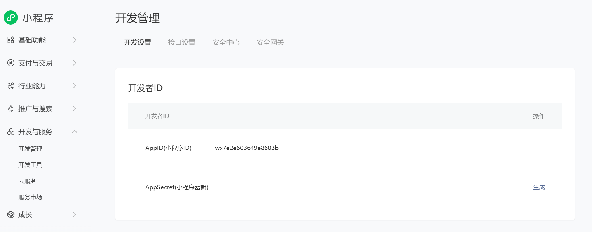
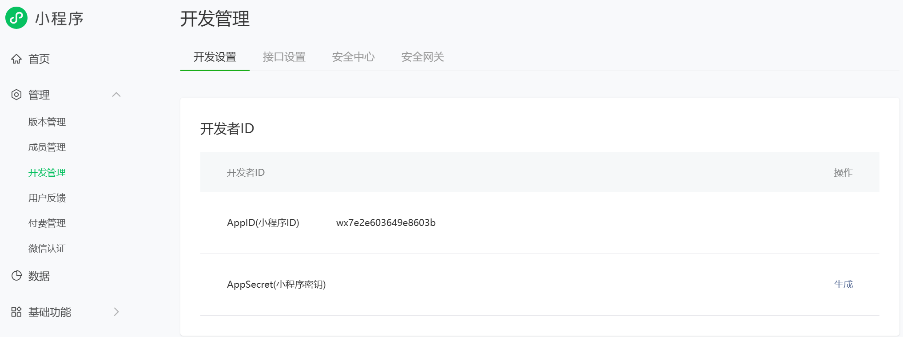
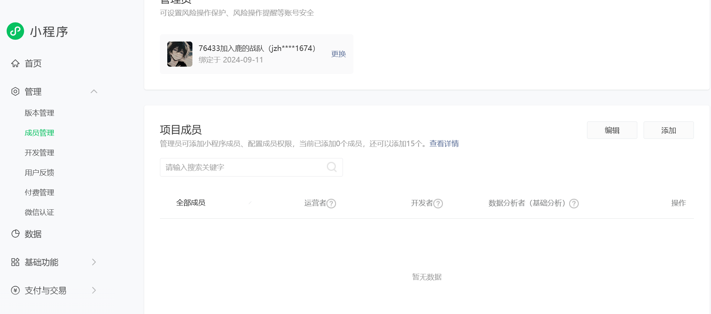

# 微信小程序开发（一）

## 认识微信小程序

> 微信小程序实， `Mini Program`
>
> 对于开发者而言实际上微信小程序门槛的开发是十分低的

> **软件APP 分类:**
>
> * **原生APP**： native app : `ios(object c)`  `android(java\kotlin)`  `windows phone(C#)`
> * **web APP**:  h5 + CSS + JavaScript 
> * **hybird app**:  混合的app原生 + web
> * **light APP**: 轻应用： 寄生于另一个 APP ，存在的具有一定功能的APP，微信小程序，基于微信实现运行的 APP 应用  

> **客户端和服务端**
>
> * 我们的平时使用的手机或者说浏览器就是我们的客户端，就是我们的前端
> * 服务端： 就是实现的是我们的操作数据库以及操作数据的一个开发方向

## 小程序开发者注册

[微信小程序的开发登录](https://mp.weixin.qq.com)

完成登录后，我们就可以实现的是完善自己的个人信息了

> 这个时候我们就可以发现的是我们的是具备
>
> * 小程序信息的完善
> * 小程序类目的完善
>   * 小程序类目就是实现的是确定我们的微信小程序主要是用来做什么的
>   * 一般的话就**不用进行选择我们的游戏类目**，因为这个是来进行的是我们的微信小程序游戏的开发实现了
> * 小程序备案的完善
> * 微信认证信息完善 —— 这个一般不会使用，因为含有关于商务信息方面的知识使用了

## 获取小程序的 appid

> * 上面的信息注册完后，我们就要开始实现获取我们的 appid
> * 就是在我们的开发于服务中开发管理
> * `wx7e2e603649e8603b`

## 版本管理

> * 我们的小程序的开发是具备我们的开发版本的

> * 选择我们的版本管理即可
> * 这里呐一共具备了我们的三个版本
>   * 开发版本 ——  就是我们的代码书写保存的版本
>   * 审核版本 ——  然后就是将我们的开发版本进行小程序官方的审核
>   * 线上版本 ——  审核成功后，我们就可以实现的是实现发布上线，成为线上版本
> * 一共是具备了我们的三个版本的

## 成员管理

> * 我们的项目成元素分为了三种
>   * 第一种是： 项目管理员
>   * 第二种是：项目成员管理，参与的是小程序的开发，同时参与小程序的体验开发权限
>   * 第三种是：体验成员管理

## 下载微信小程序开发工具

> 我们实现开发我们自己的微信小程序的时候，我们是可以下载微信小程序的开发工具的
>
> **[下载链接](https://developers.weixin.qq.com/miniprogram/dev/devtools/devtools.html)**
>
> 同时到了后面，我们也是可以使用我们的多端的运行框架实现最基本的多端编辑的框架实现我们的开发
>
> * taro   凹凸实验室的作品
> * uniapp
> * flutter