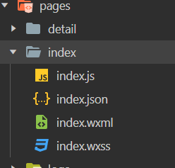
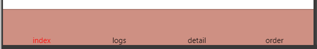

# 微信小程序开发（三）

## 全局配置

> * 小程序的**全局配置**存放的地方是我们的**项目目录的根目录下的**
> * 小程序的实现的话，我们是具有描述整个程序的 `app` 和 多个描述页面的 `page` 目录的
> * 一个小程序的主体的话，是具备三个文件的，这三个文件是放置在我们的根目录下的
>   * `app.js` 小程序的业务逻辑方面的，书写 `javascript` 的地方
>   * `app.json` 整个小程序的配置文件，**小程序的公共设置**
>   * `app.wxss` 整个小程序的**公共样式文件**，书写样式 `CSS` 的地方


## pages 目录

> 实现书写的就是我们的每个小程序项目中每个页面的书写配置文件
>
> * 每个目录页面目录下面的话一共含有了四个文件
>   * `.js`  每个页面的处理逻辑书写的地方
>   * `.wxml`  每个页面的结构排版书写的地方
>   * `.json`  每个页面的配置文件
>   * `.wxss`  每个页面的 CSS 部分的文件书写
> * 


## 全局配置 app.json

> **[全局配置官网描述](https://developers.weixin.qq.com/miniprogram/dev/framework/config.html#%E5%85%A8%E5%B1%80%E9%85%8D%E7%BD%AE)**
>
> 我们的全局配置可以做什么呐？？？
>
> * 直接看官方描述
> * **小程序根目录下的 `app.json` 文件用来对微信小程序进行全局配置，决定页面文件的路径、窗口表现、设置网络超时时间、设置多 tab 等。**


### entryPagePath 小程序默认启动首页

> 实现指定的是我们的小程序默认进入的首页面，后面直接跟路径即可
>
> 如果我们不指定这个 **entryPagePath** 属性配置的话，我们默认进行入的就是 **pages** 配置中的第一个选项
>
> `"entryPagePath": "pages/index/index"`


### pages 页面路径列表

> 实现的是配置我们小程序具有那些页面的一个配置项
>
> 是一个页面的配置列表
>
> ```json
> "pages": [
>   "pages/index/index",
>   "pages/logs/logs",
>   "pages/detail/detail",
>   "pages/order/order"
> ],
> ```


### window 全局的默认窗口表现

> window 配置下的配置就含有很多的配置项
>
> 都是用来实现配置的是我们的小程序窗口的默认的窗口显示配置


### networkTimeout 网络超时时间

> 这个属性的配置就是实现的是配置我们的网络超时时间
>
> ```json
>  "networkTimeout": {
>     "request": 2000,
>     "connectSocket": 2000,
>     "uploadFile": 2000,
>     "downloadFile": 2000
>   }
> ```
>
> 里面的配置项目就是含有了我们的`请求时间限制`  `连接时间限制` `上传文件时间限制` `下载文件时间限制`


### debug

> **就是实现的是我们的小程序是否开启调试模式**
>
> * boolean 类型的值，默认是开启的
>
> * 可以在开发者工具中开启 `debug` 模式，在开发者工具的控制台面板，调试信息以 `info` 的形式给出，其信息有 Page 的注册，
>   * 页面路由，数据更新，事件触发等。可以帮助开发者快速定位一些常见的问题。
>
> * `"debug": true,`


### tabBar  底部 `tab` 栏的表现

> ```json
>   "tabBar": {
>     "backgroundColor": "#ce9083",
>     "borderStyle": "black",
>     "color": "#000000",
>     "selectedColor": "#ff0000",
>     "list": [
>       {
>         "pagePath": "pages/index/index",
>         "text": "index"
>       },
>       {
>         "pagePath": "pages/logs/logs",
>         "text": "logs"
>       },
>       {
>         "pagePath": "pages/detail/detail",
>         "text": "detail"
>       },
>       {
>         "pagePath": "pages/order/order",
>         "text": "order"
>       }
>     ]
>   },
> ```
>
> **tabBar** 的基本的配置展示




## 页面配置文件

[单个pages 页面下的配置文件](https://developers.weixin.qq.com/miniprogram/dev/reference/configuration/page.html)

> 同时我们后期还是可以进行的是使用我们的 JavaScript 来实现设置我们的页面的展示效果的


## sitemap 配置

> 该配置主要是用于实现的我们的微信已经开放了小程序搜索，开发者通过 sitemap.json 配置
>
> 或者说通过管理后台页面收录开关来配置小程序页面是否允许微信索引
>
> 如果开放了允许微信索引，微信将开放通过爬虫的形式，为小程序页面内容建立索引
>
> 当用户搜索词条触发索引时，小程序页面会展示在搜索结果中