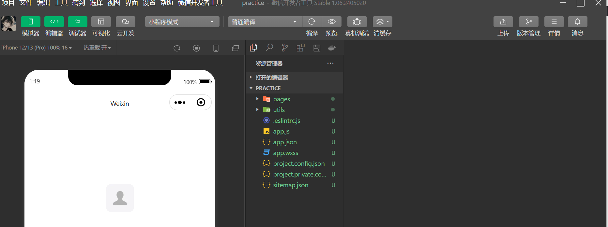
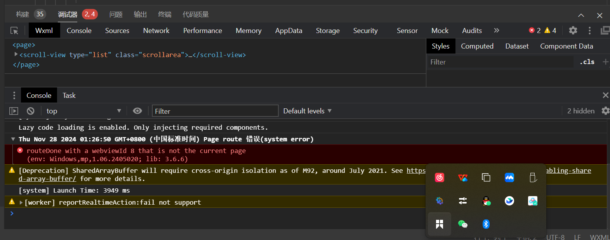
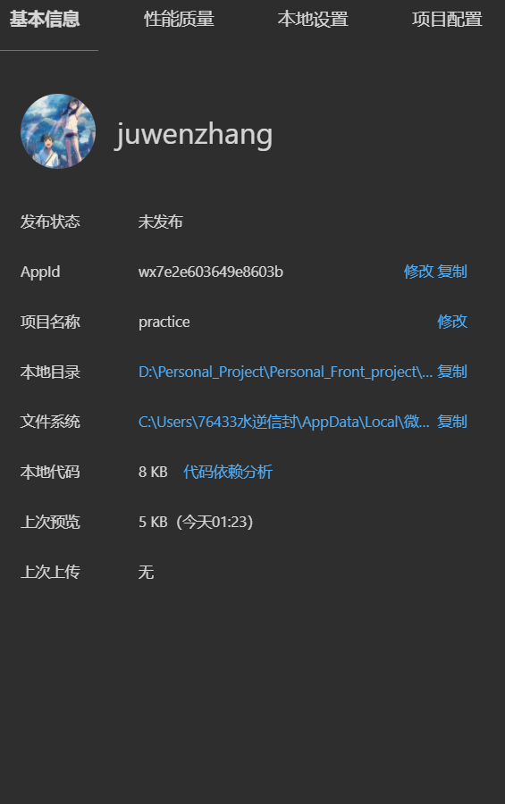
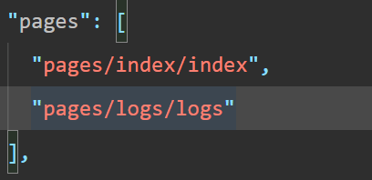
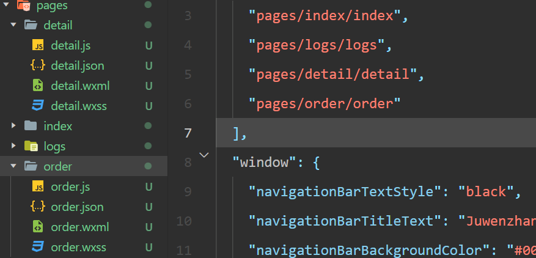
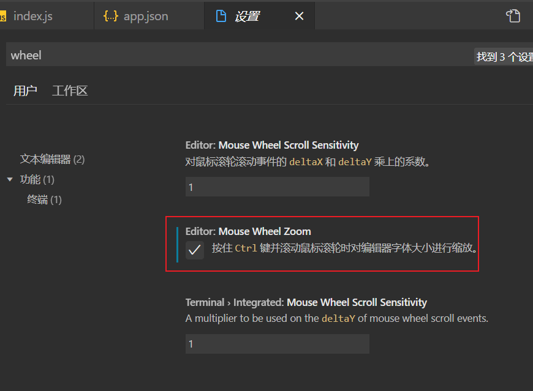

# 微信小程序开发（二）

## 创建微信小程序开发

> * 选择创建存放的目录
> * 选择使用的开发模板
> * 最开始的时候我们使用 JS 基础的开发模板即可

> * 实现使用我们的微信小程序开发的基础版本后出现的目录结构就是这样的

## 微信开发者工具的使用技巧

> * 编辑器就是我们的进行开发的时候，使用的代码编辑器
> * 模拟器就是我们需要观看具体的成品效果的时候使用的暂时
> * 调试器就是我们需要进行观看的调试工具，下面的就是我们的调试器
> * 上传： 就是实现的是我们的将我们的小程序实现上传到我们的微信的服务器中
> * 详情：就是实现的是我们的获取我们的小程序当前的状态管理

## 微信小程序创建的页面

> * 默认的情况下只是创建了两个页面
>   * index 页面
>   * logs 页面
>   * 相关页面的代码以及配置的文件都是在我们的 **pages** 目录下的
>   * 同时每一个微信小程序的页面都是含有四个文件的
>     * `.js`  `.json` `.wxml` `wxss` 四个文件名
> * **app.json**
>   * 就是实现的是我们配置我们的页面
>   * 
>   * 我们是可以通过修改 **app.json** 文件实现我们的快速创建我们的页面的
>     * 实现配置的书写格式 `pages/页面目录名/每个文件名`  ——  `"pages/detail/detail"`
>     * 这个时候就可以实现的是快速的创建我们的目录了
>     * 配置文件的书写完毕后，就可以实现的是直接 `ctrl + s` 就可以自动的产生两个文件目录了
>     * 
>   * 微信小程序的实现的时候，我们是可以设置根据鼠标滚轮来进行缩放操作的
>     * `文件 ->  首选项 -> 设置 -> wheel`
>     * 

