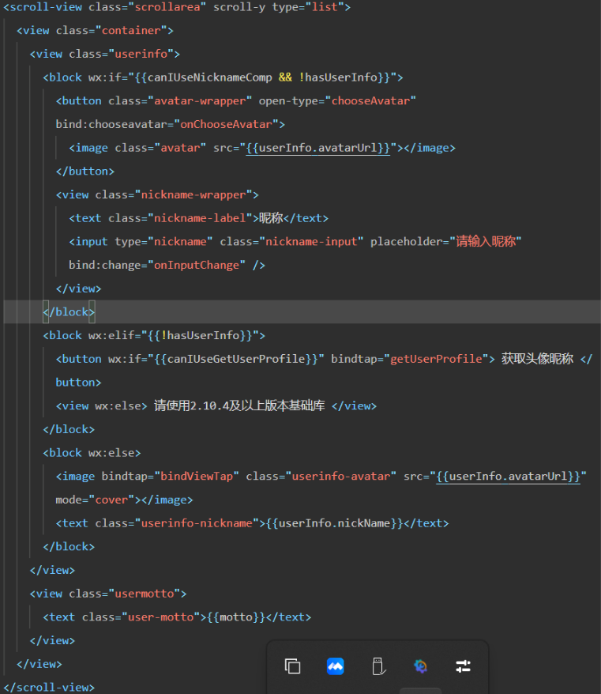

# 微信小程序开发（四）

## wxml视图结构

> * 我们的 wxml 就是实现的是我们的用来实现构建微信小程序的排版结构，相当于是我们的web开发的 HTML
> * 但是进行修改的就含有我们的标签名的不同了
>   * 在我们的 web 端的开发中，我们使用的标签是我们的 div
>   * 但是在我们的微信小程序中，我们使用的是我们的 view 标签
> * 同时微信小程序的书写还借鉴了一些关于 vue.js 框架的**模板语法和内置指令的使用**




## 数据绑定

**[数据绑定文档阅读](https://developers.weixin.qq.com/miniprogram/dev/reference/wxml/)**

> * 在前端的框架开发中，实际上都是含有一句话的，就是**数据驱动视图**
>
> * 所以说在前端的结构中，我们也是会实现使用得到我们数据来实现进行数据绑定，从而实现驱动视图的呈现的效果
> * **WXML 中的动态数据均来自对应 Page 的 data，同时这个page中的数据是在我们的 JS 文件中进行配置的**
> * 在现在的很多的开发框架中，都提倡的是我们的结构模板和js逻辑以及样式的设计实现分离的开发模式
>   * 这样是可以大大的减少我们的操作的 DOM 的次数
>   * 在 wxml 中实现获取我们的动态数据使用的模板语法就是我们的 `{{}}` 来实现的
> * `<标签>{{ 来自 JS 中的动态数据变量名 }}</标签>`

### 直接绑定显示内容

```html
<!-- 开始实现书写我们的第一个视图盒子 -->
<view class="demo">{{ message }}</view>
```

```javascript
// pages/weixin_demo/weixin_demo.js
Page({

  /**
   * 页面的初始数据
   */
  data: {
    message: "巴黎奥运会"
  },

  /**
   * 生命周期函数--监听页面加载
   */
  onLoad(options) {

  }
})    
```

> * 我们上面的案例就实现了我们的视图页面绑定了我们的 **date** 数据


### 将 JS 中的变量绑定在属性中

```html
<view id="id_{{id}}"></view>
```

```javascript
// pages/weixin_demo/weixin_demo.js
Page({

  /**
   * 页面的初始数据
   */
  data: {
    message: "巴黎奥运会",
    id: "demo"
  },

  /**
   * 生命周期函数--监听页面加载
   */
  onLoad(options) {

  }
})    
```


### 三元运算符使用

```html
<view>{{is_login? "成功登录" : "用户未登录"}}<view>
```

```javascript
// pages/weixin_demo/weixin_demo.js
Page({

  /**
   * 页面的初始数据
   */
  data: {
    message: "巴黎奥运会",
    id: "demo",
    is_login: true
  },

  /**
   * 生命周期函数--监听页面加载
   */
  onLoad(options) {

  }
})    
```


## 列表渲染

**[列表渲染文档阅读](https://developers.weixin.qq.com/miniprogram/dev/reference/wxml/list.html)**

> * 使用的微信小程序指令是: `wx:for`
>   * `wx:for-item` 指定数组当前的元素变量名，默认的是 `item` 来实现指定元素名
>   * `wx:for-index` 指定数组中元素的下标变量名，默认的是 `index` 来实现的指定下标
>   * `wx:key` 指定循环渲染的时候唯一的标识符，尽量用，否则有警告，来源数据中没有的 id 标识符的话，就是使用的是 *this
>     * `wx:key="*this"`
> * 在组件上使用 `wx:for` 控制属性绑定一个数组，即可使用数组中各项的数据重复渲染该组件

```html
<view>
  <view wx:for="{{objectArray}}" wx:key="*this">
    {{item.unique}}
  </view>
</view>

<!-- 或者说直接使用我们的其他语法也行 -->
<view>
  <view wx:for="{{objectArray}}" wx:for-item="unique" wx:for-index="position" wx:key="*this">
  	{{ unique.unique}} - {{ position }}
  </view>
</view>
```

```javascript
	objectArray: [
      {id: 5, unique: 'unique_5'},
      {id: 4, unique: 'unique_4'},
      {id: 3, unique: 'unique_3'},
      {id: 2, unique: 'unique_2'},
      {id: 1, unique: 'unique_1'},
      {id: 0, unique: 'unique_0'},
    ]
```


### 条件渲染

> * `wx:if="condition"`
>   * 同时也是可以使用 `wx:elif` 和 `wx:else` 来实现多添加几个条件代码块的